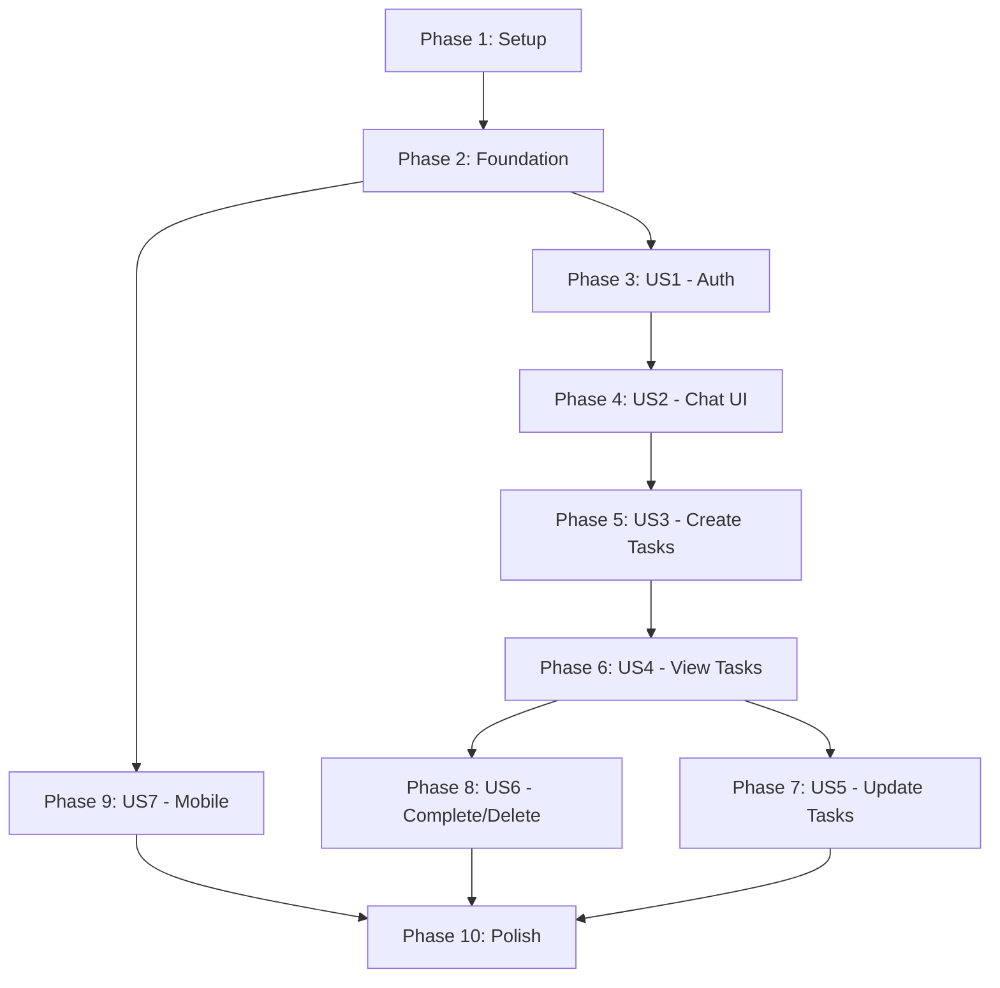

# Implementation Tasks: AI-Powered Chatbot Frontend

**Feature**: 002-chatbot-frontend
**Branch**: `002-chatbot-frontend`
**Date**: 2026-02-06
**Spec**: [spec.md](./spec.md) | **Plan**: [plan.md](./plan.md)

## Overview

This document contains the implementation tasks for the chatbot frontend, organized by user story to enable independent, incremental delivery. Each phase corresponds to a user story from the specification and can be implemented and tested independently.

**Total Tasks**: 85
**MVP Scope**: Phases 1-5 (US1, US2, US3 - Tasks T001-T044)
**Parallelization Opportunities**: 47 tasks marked [P] can run in parallel

## Task Organization

Tasks are organized into phases:
- **Phase 1**: Setup (9 tasks) - Project initialization
- **Phase 2**: Foundational (8 tasks) - Shared infrastructure
- **Phase 3**: US1 - Authentication (11 tasks) - User login/registration
- **Phase 4**: US2 - Chat Interface (9 tasks) - Conversational UI
- **Phase 5**: US3 - Create Tasks (7 tasks) - Task creation via chatbot
- **Phase 6**: US4 - View/Filter Tasks (6 tasks) - Task listing
- **Phase 7**: US5 - Update Tasks (6 tasks) - Task modification
- **Phase 8**: US6 - Complete/Delete Tasks (5 tasks) - Task lifecycle
- **Phase 9**: US7 - Mobile Responsive (12 tasks) - Responsive design
- **Phase 10**: Polish (12 tasks) - Cross-cutting concerns

**Legend**:
- `[P]` - Parallelizable (can run simultaneously with other [P] tasks in same phase)
- `[US#]` - User Story number (maps to spec.md)
- File paths are relative to `/frontend/` directory

---

## Phase 1: Setup & Project Initialization

**Goal**: Initialize Next.js project with required dependencies and configuration

**Tasks**:

- [ ] T001 Create Next.js 14 project with TypeScript and Tailwind CSS using `npx create-next-app@latest frontend --typescript --tailwind --app --src-dir=false`
- [ ] T002 Install core dependencies: `npm install axios react-hook-form @hookform/resolvers zod date-fns lucide-react @headlessui/react`
- [ ] T003 Install dev dependencies: `npm install -D @types/node @testing-library/react @testing-library/jest-dom jest jest-environment-jsdom @playwright/test eslint-config-next`
- [ ] T004 Configure TypeScript in tsconfig.json with path aliases (@/ for root, @/components, @/services, etc.)
- [ ] T005 Configure Tailwind CSS in tailwind.config.ts with custom breakpoints (sm: 640px, md: 768px, lg: 1024px) and touch-friendly utilities (minHeight: touch = 44px)
- [ ] T006 Create environment variables template file .env.local.example with NEXT_PUBLIC_API_URL placeholder
- [ ] T007 [P] Create directory structure: app/, components/, services/, hooks/, lib/, types/, contexts/, tests/
- [ ] T008 [P] Configure Next.js in next.config.js with output: 'standalone', reactStrictMode: true
- [ ] T009 [P] Setup ESLint and Prettier configurations for code quality

**Acceptance**: Project runs with `npm run dev` and shows Next.js default page on http://localhost:3000

---

## Phase 2: Foundational Layer

**Goal**: Implement shared infrastructure used by all user stories

**Independent Test**: Axios instance successfully attaches Authorization header to test request; localStorage token helpers work correctly

**Tasks**:

- [ ] T010 [P] Create TypeScript type definitions in types/api.types.ts for APIError, ValidationError, FieldError
- [ ] T011 [P] Create TypeScript type definitions in types/auth.types.ts for User, AuthTokens, LoginRequest, RegisterRequest, LoginResponse, RegisterResponse, RefreshTokenRequest, RefreshTokenResponse
- [ ] T012 [P] Create TypeScript type definitions in types/task.types.ts for Task, TaskStatus enum, TaskPriority enum, TaskCreate, TaskUpdate, TaskListResponse, TaskFilters
- [ ] T013 [P] Create TypeScript type definitions in types/chat.types.ts for ChatMessage, ChatIntent enum, MessageSender enum, ChatRequest, ChatResponse
- [ ] T014 Create token management utilities in lib/token.ts with functions: getAccessToken(), getRefreshToken(), setTokens(access, refresh), clearTokens()
- [ ] T015 Create Axios instance in services/api.ts with baseURL from env, request interceptor to attach JWT, response interceptor to handle 401 and token refresh
- [ ] T016 [P] Create UI primitives in components/ui/: Button.tsx, Input.tsx, Spinner.tsx, ErrorMessage.tsx with Tailwind styling
- [ ] T017 [P] Create date formatting utilities in lib/formatters.ts using date-fns: formatDate(date, format), formatRelativeTime(date)

**Acceptance**: Import and use Axios instance, token helpers, and UI components without errors; types provide autocomplete

---

## Phase 3: User Story 1 - Authentication Flow (Priority P1)

**Goal**: Implement user registration, login, token refresh, and logout

**Independent Test**: User can register → login → tokens stored in localStorage → logout → tokens cleared. Token refresh works automatically on 401 error.

**Tasks**:

- [ ] T018 [P] [US1] Create AuthContext provider in contexts/AuthContext.tsx with state for user, loading, and functions: login(), register(), logout(), refreshToken()
- [ ] T019 [P] [US1] Create useAuth hook in hooks/useAuth.ts that consumes AuthContext and throws error if used outside provider
- [ ] T020 [US1] Implement auth service in services/auth.service.ts with API calls: register(email, password), login(email, password), refresh(refreshToken), logout()
- [ ] T021 [US1] Create LoginForm component in components/auth/LoginForm.tsx using react-hook-form with Zod validation (email format, password min 8 chars)
- [ ] T022 [US1] Create RegisterForm component in components/auth/RegisterForm.tsx using react-hook-form with Zod validation
- [ ] T023 [US1] Create ProtectedRoute component in components/auth/ProtectedRoute.tsx that redirects to /login if no valid token
- [ ] T024 [US1] Create login page in app/(auth)/login/page.tsx with LoginForm and link to register
- [ ] T025 [US1] Create register page in app/(auth)/register/page.tsx with RegisterForm and link to login
- [ ] T026 [US1] Create auth layout in app/(auth)/layout.tsx with centered form container (no navbar)
- [ ] T027 [US1] Implement token refresh logic in AuthContext: on mount, check localStorage for tokens → verify with backend → set user state
- [ ] T028 [US1] Implement automatic logout on refresh failure in Axios response interceptor: if refresh returns 401, clear tokens and redirect to /login

**Acceptance Criteria**:
- User can register with email/password → redirected to chat interface
- User can login → JWT tokens stored in localStorage → redirected to chat
- Access token expiry triggers automatic refresh using refresh token
- Logout clears tokens and redirects to login page
- Invalid credentials show error message "Incorrect email or password"
- Validation errors display under form fields (e.g., "Invalid email address")

---

## Phase 4: User Story 2 - Chatbot Conversation Interface (Priority P1)

**Goal**: Build conversational chat UI with message history, input field, and typing indicators

**Independent Test**: User can type message → click send → message appears in chat history → typing indicator shows → bot response appears. Auto-scroll works when messages exceed viewport.

**Tasks**:

- [ ] T029 [P] [US2] Create chat service in services/chat.service.ts with sendMessage(message, context?) API call to POST /api/chat/message
- [ ] T030 [P] [US2] Create useChat hook in hooks/useChat.ts managing state: messages[], input, isTyping, error, functions: sendMessage(), clearHistory()
- [ ] T031 [P] [US2] Create MessageBubble component in components/chat/MessageBubble.tsx displaying sender (user/bot), content, timestamp with different styling for user (right, blue) vs bot (left, gray)
- [ ] T032 [P] [US2] Create TypingIndicator component in components/chat/TypingIndicator.tsx with animated dots (3 bouncing circles)
- [ ] T033 [P] [US2] Create TaskCard component in components/chat/TaskCard.tsx displaying task with status icon (✓ completed, ○ pending), priority indicator (🔴 urgent, 🟡 high), title, and due date
- [ ] T034 [US2] Create MessageList component in components/chat/MessageList.tsx rendering messages array with auto-scroll to bottom using useEffect + scrollIntoView
- [ ] T035 [US2] Create MessageInput component in components/chat/MessageInput.tsx with textarea (max 1000 chars), send button, Enter key handler (Shift+Enter for newline)
- [ ] T036 [US2] Create ChatInterface component in components/chat/ChatInterface.tsx composing MessageList, MessageInput, TypingIndicator with useChat hook integration
- [ ] T037 [US2] Create chat page in app/(chat)/page.tsx rendering ChatInterface with ProtectedRoute wrapper and initial "help" message

**Acceptance Criteria**:
- User can type message and send via button or Enter key
- User message appears immediately in chat history (right side, blue bubble)
- Typing indicator shows while waiting for bot response
- Bot response appears in chat history (left side, gray bubble)
- Chat auto-scrolls to show latest message when new message arrives
- Typing "help" shows list of supported commands with examples
- Error messages display in chat if API call fails

---

## Phase 5: User Story 3 - Create Tasks via Chatbot (Priority P1)

**Goal**: Enable task creation through natural language chatbot commands

**Independent Test**: User types "create a task to buy groceries tomorrow" → task created with correct title and due date → bot confirms with task details (title, priority, due date).

**Tasks**:

- [ ] T038 [P] [US3] Create task service in services/task.service.ts with createTask(taskData) API call to POST /api/tasks (fallback, chatbot uses /api/chat/message)
- [ ] T039 [US3] Update MessageBubble component to render TaskCard when bot response contains task data (check response.data.task_id)
- [ ] T040 [US3] Update ChatInterface to handle create_task intent: parse response.data for task details and display confirmation message
- [ ] T041 [US3] Add clarification flow handling in ChatInterface: if response.clarification_needed === true, display clarification_questions as bot message
- [ ] T042 [US3] Implement priority indicator rendering in TaskCard: map priority (urgent → 🔴, high → 🟡, medium → no icon, low → 🔵)
- [ ] T043 [US3] Implement error handling in useChat: display user-friendly error messages ("Unable to create task. Please try again.") when API returns 500 or network fails
- [ ] T044 [US3] Add input validation in MessageInput: show character count (X/1000) and disable send button when empty or over 1000 chars

**Acceptance Criteria**:
- User can type "create a task to buy groceries" → task created with title "buy groceries", default priority (medium)
- User can type "remind me to call John tomorrow" → task created with due date = tomorrow
- User can type "add urgent task to fix bug" → task created with priority = urgent, red indicator shown
- Bot response shows task confirmation with formatted details (✓ Task created: 'X' (Priority: Y) (Due: Z))
- Clarification flow works: bot asks "What should the task be called?" → user answers → task created
- Error messages are user-friendly, not raw API errors

---

## Phase 6: User Story 4 - View and Filter Tasks (Priority P2)

**Goal**: Display task list and support filtering by status, priority, due date

**Independent Test**: User types "show my tasks" → all tasks displayed with icons and dates. User types "show pending tasks" → only pending tasks shown.

**Tasks**:

- [ ] T045 [P] [US4] Extend task service in services/task.service.ts with listTasks(filters?) API call to GET /api/tasks with query params
- [ ] T046 [P] [US4] Create TaskList component in components/chat/TaskList.tsx rendering array of TaskCard components with "No tasks" empty state
- [ ] T047 [US4] Update ChatInterface to handle list_tasks intent: render TaskList component when response.intent === 'list_tasks'
- [ ] T048 [US4] Implement filter parsing in useChat: detect filter keywords in user message (e.g., "pending", "urgent", "today") and pass to API
- [ ] T049 [US4] Implement pagination in TaskList: show "Showing X of Y tasks" footer when total > page_size (20)
- [ ] T050 [US4] Add empty state handling in TaskList: display "You don't have any tasks. Try creating one!" when tasks array is empty

**Acceptance Criteria**:
- User types "show my tasks" → all tasks displayed with status icons, priority indicators, due dates
- User types "show pending tasks" → only pending tasks displayed
- User types "show urgent tasks" → only urgent priority tasks displayed with red indicators
- Empty state shows when no tasks match filter: "You don't have any tasks with status 'pending'"
- Pagination indicator shows "Showing 20 of 45 tasks" when applicable
- Tasks are sorted by priority (urgent → high → medium → low) then by due date

---

## Phase 7: User Story 5 - Update Tasks (Priority P3)

**Goal**: Allow users to modify existing tasks via chatbot

**Independent Test**: User creates task → types "update task 1 to high priority" → task priority updated → bot confirms change.

**Tasks**:

- [ ] T051 [P] [US5] Extend task service in services/task.service.ts with updateTask(taskId, updates) API call to PUT /api/tasks/{id}
- [ ] T052 [US5] Update ChatInterface to handle update_task intent: parse task reference (number or title) from message and extract update fields
- [ ] T053 [US5] Implement task reference parsing in useChat: support "task 1", "first task", or "task named 'buy groceries'"
- [ ] T054 [US5] Implement update confirmation in ChatInterface: display old vs new values (e.g., "Priority changed: medium → high")
- [ ] T055 [US5] Add "task not found" error handling: if task reference doesn't match, bot responds "Task not found. You have X tasks."
- [ ] T056 [US5] Implement multi-field updates: support "update task 1 to high priority due tomorrow" (parse multiple fields)

**Acceptance Criteria**:
- User types "update task 1 to high priority" → first task's priority changed to high → bot confirms "✓ Task updated: priority changed (medium → high)"
- User types "change the 'buy groceries' task due date to tomorrow" → due date updated → bot confirms with new date
- User types "update task 10" when only 3 tasks exist → bot responds "Task not found. You have 3 tasks."
- Update intent is not available initially, shows "Coming soon" placeholder message

---

## Phase 8: User Story 6 - Complete and Delete Tasks (Priority P3)

**Goal**: Mark tasks complete or delete them via chatbot

**Independent Test**: User creates task → types "mark task 1 as done" → task status changes to completed → checkmark shown. User types "delete task 2" → task soft-deleted.

**Tasks**:

- [ ] T057 [P] [US6] Extend task service in services/task.service.ts with completeTask(taskId) API call to PATCH /api/tasks/{id}/complete
- [ ] T058 [P] [US6] Extend task service in services/task.service.ts with deleteTask(taskId) API call to DELETE /api/tasks/{id}
- [ ] T059 [US6] Update ChatInterface to handle complete_task intent: mark task as completed and update UI
- [ ] T060 [US6] Update ChatInterface to handle delete_task intent: remove task from list and show confirmation
- [ ] T061 [US6] Implement completion confirmation in TaskCard: show ✓ icon and strikethrough text for completed tasks

**Acceptance Criteria**:
- User types "mark task 1 as done" → task status changes to completed → checkmark (✓) icon shown → bot confirms "✓ Task completed: 'buy groceries'"
- User types "complete the first task" → same behavior as above
- User types "delete task 2" → task soft-deleted (is_deleted = true) → bot confirms "✓ Task deleted: 'call John'"
- Completed tasks show with strikethrough text and checkmark
- Complete and delete intents not available initially, show "Coming soon" placeholder

---

## Phase 9: User Story 7 - Mobile Responsive Design (Priority P1)

**Goal**: Ensure chatbot interface works seamlessly on mobile, tablet, and desktop devices

**Independent Test**: Open app on mobile (375px), tablet (768px), desktop (1024px+) → layout adapts correctly → touch targets are 44px minimum → no horizontal scrolling.

**Tasks**:

- [ ] T062 [P] [US7] Create responsive layout in app/layout.tsx with mobile-first breakpoints (< 768px = mobile, 768-1024px = tablet, > 1024px = desktop)
- [ ] T063 [P] [US7] Update Header component in components/layout/Header.tsx with responsive padding (px-4 mobile, px-8 desktop) and collapsible menu
- [ ] T064 [P] [US7] Update ChatInterface with responsive container width (100% mobile, max-w-4xl desktop) and bottom padding for keyboard
- [ ] T065 [P] [US7] Update MessageInput with mobile keyboard handling: detect visualViewport API and adjust container height when keyboard opens
- [ ] T066 [P] [US7] Update Button component with minimum touch target: min-h-[44px] min-w-[44px] for mobile accessibility
- [ ] T067 [P] [US7] Update TaskCard with responsive layout: stack vertically on mobile (< 768px), horizontal on tablet/desktop
- [ ] T068 [US7] Create mobile-specific CSS in globals.css: safe-area-inset padding for iOS notch, -webkit-tap-highlight-color transparent
- [ ] T069 [US7] Implement viewport meta tag in app/layout.tsx: width=device-width, initial-scale=1, maximum-scale=5 (allow zoom for accessibility)
- [ ] T070 [US7] Test on real mobile devices (iOS Safari, Android Chrome) and fix viewport issues (keyboard overlap, fixed positioning)
- [ ] T071 [US7] Implement orientation change handling: preserve scroll position and input focus when rotating device
- [ ] T072 [US7] Add touch-friendly spacing: increase tap target spacing to 8px minimum between interactive elements
- [ ] T073 [US7] Create responsive font sizes using Tailwind's text utilities: text-sm mobile, text-base desktop

**Acceptance Criteria**:
- Interface renders correctly on mobile (375px width) without horizontal scrolling
- Touch targets are minimum 44x44px (buttons, inputs, task cards)
- Mobile keyboard doesn't cover input field when typing
- Interface adapts to tablet (768-1024px) with 2-column layout where appropriate
- Desktop (> 1024px) shows full-width chat interface with sidebar navigation
- Device rotation (portrait ↔ landscape) doesn't lose scroll position or input focus
- No layout shifts or jumpy UI when navigating between pages
- Lighthouse mobile score > 90 for accessibility

---

## Phase 10: Polish & Cross-Cutting Concerns

**Goal**: Add error handling, loading states, performance optimizations, and testing

**Independent Test**: App shows meaningful error messages on network failures. Loading states appear during API calls. Lighthouse score > 90. All critical paths have tests.

**Tasks**:

- [ ] T074 [P] Implement global error boundary in app/error.tsx with user-friendly error message and "Retry" button
- [ ] T075 [P] Add loading skeleton components in components/ui/Skeleton.tsx for MessageList, TaskList during data fetching
- [ ] T076 [P] Implement optimistic UI updates in useChat: add message to chat immediately, roll back on error
- [ ] T077 [P] Add debouncing to MessageInput: prevent duplicate sends with disabled button state during API call (isTyping = true)
- [ ] T078 [P] Create custom 404 page in app/not-found.tsx with link back to chat interface
- [ ] T079 [P] Implement Content Security Policy (CSP) headers in next.config.js to mitigate XSS attacks
- [ ] T080 Implement code splitting with dynamic imports: `const ChatInterface = dynamic(() => import('@/components/chat/ChatInterface'))`
- [ ] T081 Add React.memo to expensive components: MessageBubble, TaskCard to prevent unnecessary re-renders
- [ ] T082 Write unit tests for core components using Jest + React Testing Library: LoginForm, RegisterForm, MessageBubble, TaskCard (4 test files)
- [ ] T083 Write integration tests for auth flow: register → login → token stored → logout → token cleared (tests/integration/auth.test.ts)
- [ ] T084 Write E2E tests with Playwright: full user journey from register → login → create task → view tasks → logout (tests/e2e/chat.spec.ts)
- [ ] T085 Run Lighthouse audit and fix performance issues: code splitting, image optimization, unused CSS removal (target score > 90)

**Acceptance Criteria**:
- Network errors show user-friendly message "Unable to connect. Check your internet."
- Loading skeletons appear while fetching tasks (no blank screens)
- Optimistic UI: message appears immediately when user sends, doesn't wait for API
- Duplicate sends prevented (send button disabled while processing)
- 404 page shows when navigating to non-existent route
- CSP headers block inline scripts (mitigates XSS)
- Code splitting reduces initial bundle size < 200KB (gzipped)
- Unit tests cover 70%+ of components (npm run test shows coverage report)
- E2E tests pass for critical user journeys (register, login, create task, logout)
- Lighthouse Performance score > 90, Accessibility score > 95

---

## Dependencies & Execution Order

### User Story Completion Order



**Critical Path** (Must complete in order):
1. Phase 1 (Setup) → Phase 2 (Foundation)
2. Phase 2 → Phase 3 (US1 - Auth) - **BLOCKING** for all other user stories
3. Phase 3 → Phase 4 (US2 - Chat UI) - **BLOCKING** for US3, US4, US5, US6
4. Phase 4 → Phase 5 (US3 - Create) - **MVP COMPLETE** at this point
5. Phase 5 → Phase 6 (US4 - View) - Independent from US5, US6

**Parallel Opportunities**:
- Phase 9 (US7 - Mobile) can start after Phase 2 (Foundation)
- Phase 7 (US5 - Update) and Phase 8 (US6 - Complete/Delete) are independent, can run in parallel after Phase 6
- Within each phase, tasks marked [P] can run in parallel

### MVP Scope (Minimum Viable Product)

**Phases 1-5 (Tasks T001-T044)** constitute the MVP:
- ✅ Setup & Foundation (T001-T017)
- ✅ User Authentication (T018-T028)
- ✅ Chat Interface (T029-T037)
- ✅ Create Tasks via Chatbot (T038-T044)

**MVP Delivers**:
- User can register and login
- User can chat with bot
- User can create tasks using natural language
- Tokens are securely stored and refreshed
- Mobile-responsive (basic)

**Post-MVP** (Phases 6-10):
- View/filter tasks (P2)
- Update tasks (P3)
- Complete/delete tasks (P3)
- Advanced mobile optimization (P1 but can follow MVP)
- Polish, tests, performance (ongoing)

### Parallel Execution Examples

**Phase 1 (Setup) - Can run in parallel after T001-T003**:
```bash
# Terminal 1
npm run task T007  # Create directory structure

# Terminal 2
npm run task T008  # Configure Next.js

# Terminal 3
npm run task T009  # Setup linting
```

**Phase 2 (Foundation) - All [P] tasks can run in parallel**:
```bash
# Terminal 1: Create type definitions
task T010 && task T011 && task T012 && task T013

# Terminal 2: Create UI components
task T016

# Terminal 3: Create utilities
task T017
```

**Phase 4 (US2 - Chat UI) - Parallelizable tasks**:
```bash
# Terminal 1: Services and hooks
task T029 && task T030

# Terminal 2: UI components
task T031 && task T032 && task T033
```

---

## Implementation Strategy

### Incremental Delivery Plan

1. **Sprint 1 (MVP)**: Phases 1-5 (T001-T044)
   - Deliverable: Users can register, login, and create tasks via chatbot
   - Timeline: 1-2 weeks
   - Demo: Live demo of task creation flow

2. **Sprint 2 (View & Manage)**: Phases 6-8 (T045-T061)
   - Deliverable: Users can view, update, complete, and delete tasks
   - Timeline: 1 week
   - Demo: Full CRUD operations via chatbot

3. **Sprint 3 (Mobile & Polish)**: Phases 9-10 (T062-T085)
   - Deliverable: Mobile-optimized, tested, production-ready
   - Timeline: 1 week
   - Demo: Lighthouse score report, E2E test results

### Testing Strategy

**Unit Tests** (Phase 10 - T082):
- Components: LoginForm, RegisterForm, MessageBubble, TaskCard
- Utilities: token.ts, formatters.ts
- Hooks: useAuth, useChat
- Coverage target: 70%

**Integration Tests** (Phase 10 - T083):
- Auth flow: register → login → token refresh → logout
- Chat flow: send message → receive response → display in UI
- Task flow: create → view → update → delete

**E2E Tests** (Phase 10 - T084):
- User journey: register → login → create task → view tasks → logout
- Error scenarios: invalid credentials, network failure, validation errors
- Mobile responsive: test on different viewport sizes

### Performance Targets

- Initial load: < 3 seconds on 3G
- Time to Interactive (TTI): < 5 seconds
- Chat response: < 2 seconds (including API call)
- Lighthouse Performance: > 90
- Bundle size: < 200KB (gzipped)

---

## Summary

**Total Tasks**: 85
**MVP Tasks**: 44 (Phases 1-5)
**Parallelizable Tasks**: 47 marked with [P]
**User Stories**: 7 (P1: 4 stories, P2: 1 story, P3: 2 stories)

**Task Distribution**:
- Phase 1 (Setup): 9 tasks
- Phase 2 (Foundation): 8 tasks
- Phase 3 (US1 - Auth): 11 tasks
- Phase 4 (US2 - Chat UI): 9 tasks
- Phase 5 (US3 - Create): 7 tasks
- Phase 6 (US4 - View): 6 tasks
- Phase 7 (US5 - Update): 6 tasks
- Phase 8 (US6 - Complete/Delete): 5 tasks
- Phase 9 (US7 - Mobile): 12 tasks
- Phase 10 (Polish): 12 tasks

**Ready for implementation**: All tasks have clear acceptance criteria, file paths, and can be executed independently within their phase dependencies.
